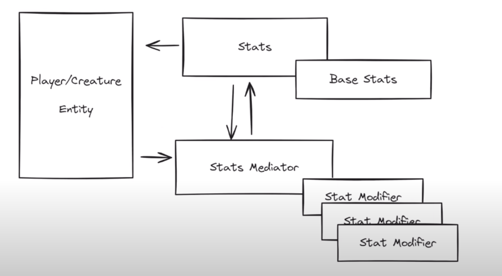

# 状态统计与修改器
Broker Chain Pattern

运行核心使用代理链模式实现，是经典责任链模式的变体
实际上是责任链模式和中介模式的组合用法

## 运行逻辑
当角色拾取到一个 `StatModifierPickup`物体时，会给当前角色`EntityNode`的`Stat`的`Mediator`添加一个对应的`StatModifier`,当角色的`Stats`中的内容被获取时，会通过`Mediator`进行状态的修改
， 同时`EntityNode`会一直更新`Mediator`的状态，当`Modifier`的持续时间过期后会进行移除。